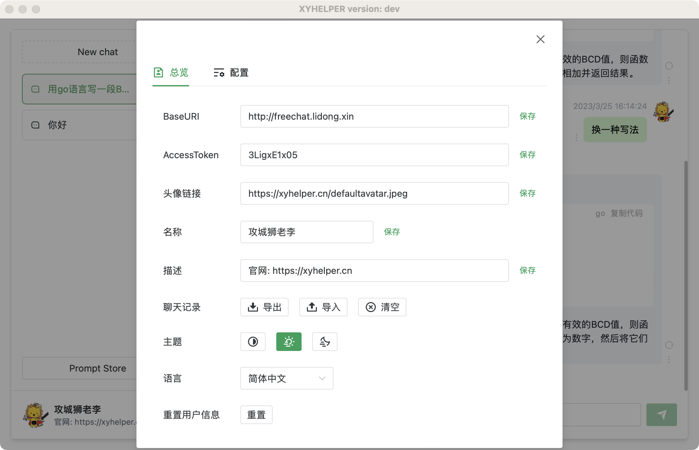

# 使用教程

## 界面预览

## 软件配置

依照图示进入配置界面

配置界面如下图所示

配置项说明：

- BaseURI：服务器地址，如：https://freechat.xyhelper.cn （注意：末尾不要加斜杠）服务器由 xyhelper 提供，也可以自行搭建。
- Token：服务器 Token，由服务器管理员提供, 用于鉴权。使用 xyhelper 提供的服务器时，填写随机字符串即可。
- 头像链接：用户头像链接，用于显示在聊天界面。
- 名称：用户名称，用于显示在聊天界面。
- 描述：用户描述，用于显示在聊天界面。
- 聊天记录: 提供聊天记录 `导入` `导出` `清空` 功能。
- 主题: 可选择当前界面显示主题风格.
- 语言: 切换界面显示语言,默认为简体中文.
- 重置用户信息: 将配置项初始化为默认值

## 关于服务器接口(BaseURI)

目前我们提供了免费接口地址(使用 chatgpt 免费帐号搭建)

- 免费接入点1: https://freechat.xyhelper.cn
- 免费接入点2: https://freechat2.xyhelper.cn

使用免费地址时 Token 可随意填写。

::: tip 提示
修改`BaseURI`或`Token`可能导致之前的会话上下文丢失.
